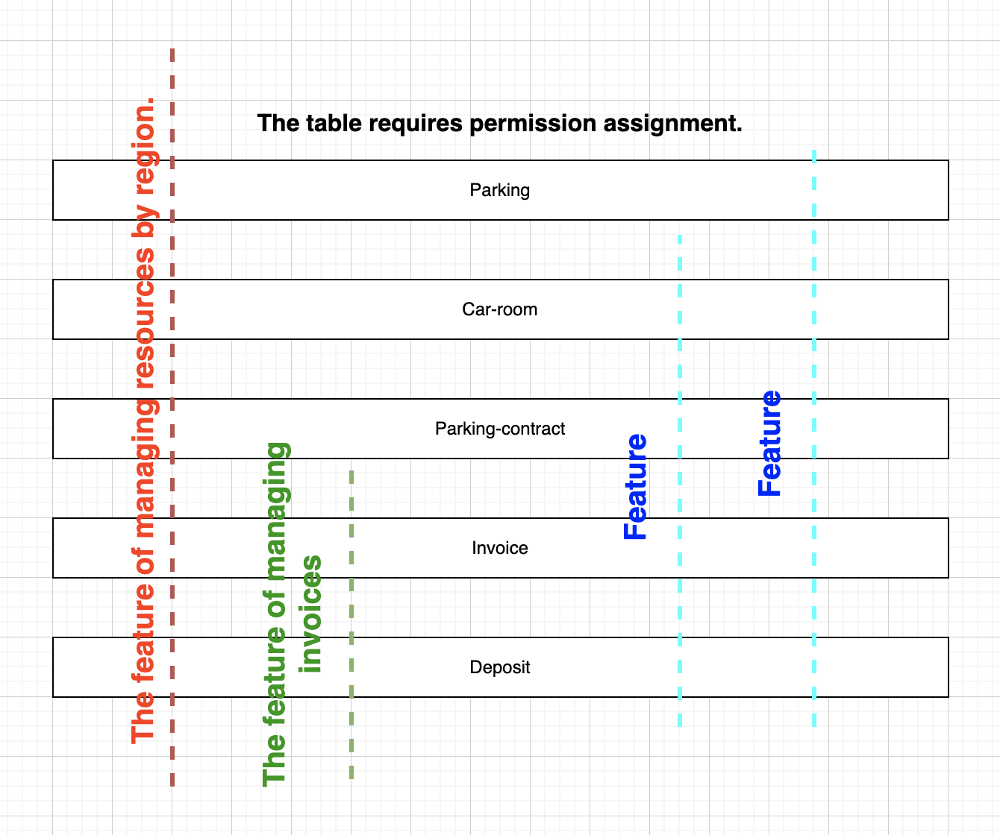
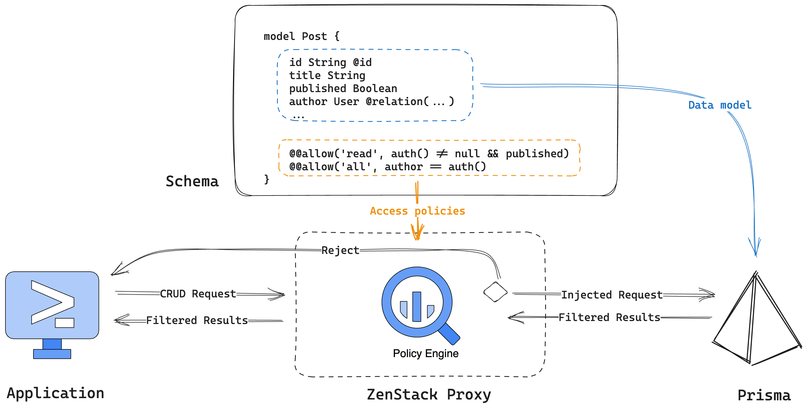

1. Vấn đề:
- Việc phân quyền người dùng truy cập vào DB thực hiện trong API: Phân quyền phân tán => Khi project cần phân quyền nhiều table, sẽ cần sửa nhiều API => Tồn tại rủi do miss chỗ cần sửa.

=> Thay vì triển khai ủy quyền theo trục tính năng, chúng ta có thể nhìn theo góc độ mô hình kinh doanh. Quy tắc sẽ được viết thành 1 câu lệnh dạng: 
+ Nếu owner staff có quyền quản lý khu vực A, staff sẽ có quyền đọc, tạo, update đối với parking, car_room, ... ở khu vực A. (Phân quyền theo staff của owner)
+ Nếu người phụ trách invoice là owner, owner có quyền tạo, update invoice, payment_item, deposit liên quan đến invoice đó. (Phân quyền theo org)

2. Overview
- ZenStack được xây dựng trên Prisma, nó có 2 extensions để thực hiện ủy quyền:
+ Schema language (ZModel): Xây dựng dựa trên Prisma Model, ZModel thêm các thuộc tính liên quan đến policies
+ Runtime API: Tạo ra Proxy cho PrismaClient dùng để validate data, check policies

3. Zenstack feature:
- ORM with built-in access control and data validation
- A plugin system for great extensibility
